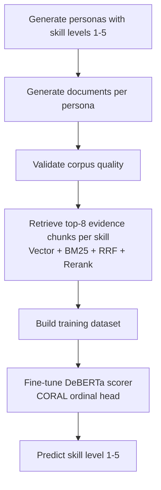

# skill-scoring-nlp-model

An end-to-end NLP system that **scores a job candidate's proficiency in a skill on a 1–5 scale** from their free-text career documents (CV, project READMEs, recommendations, LinkedIn, blog posts).

The project is fully self-contained: it **generates its own labelled training corpus** with an LLM, **retrieves the relevant evidence** for each skill with a hybrid RAG pipeline, and **trains an ordinal DeBERTa scorer** on the result. There is no external dataset dependency — synthetic personas are the ground truth.

---

## Table of contents

- [What it does](#what-it-does)
- [The pipeline at a glance](#the-pipeline-at-a-glance)
- [Headline results](#headline-results)
- [Repository layout](#repository-layout)
- [Stage 1 — Synthetic data generation](#stage-1--synthetic-data-generation)
- [Stage 2 — RAG retrieval → training data](#stage-2--rag-retrieval--training-data)
- [Stage 3 — Scoring model](#stage-3--scoring-model)
- [Installation](#installation)
- [Running the full pipeline](#running-the-full-pipeline)
- [Configuration](#configuration)
- [Results in detail](#results-in-detail)
- [Design decisions worth knowing](#design-decisions-worth-knowing)

---

## What it does

Given a candidate and a skill (e.g. *"AWS"*), the system answers: **how strong is the evidence in their documents that they are a level 1–5 practitioner of this skill?**

The scale is ordinal:

| Level | Meaning |
|---|---|
| 1 | Awareness — a passing mention |
| 2 | Working familiarity |
| 3 | Competent / day-to-day use |
| 4 | Strong / leads work in it |
| 5 | Expert / authority |

Crucially, the documents themselves **never state a proficiency word** ("expert in…", "basic knowledge of…" are banned during generation). The level must be *inferred* from how the skill is demonstrated across the candidate's corpus — which is what makes this a genuine NLP scoring task rather than keyword matching.

---

## The pipeline at a glance



---

## Headline results

Best model: **DeBERTa-v3 + CORAL ordinal head, fine-tuning the top 3 transformer layers** (`coral_top3`), on a 469-row held-out test set:

| metric | value |
|---|---|
| MAE | **0.467** |
| Exact accuracy | 0.578 |
| ±1 accuracy | **0.957** |
| Quadratic Weighted Kappa | **0.804** |
| Spearman ρ | 0.793 |

The retriever feeding the scorer is near-perfect against the generation ground truth: **Hit@8 = 0.998, Precision@8 = 0.911, MRR = 0.983**, so scoring errors are intrinsic to the scorer, not caused by missing evidence.

See [`scoring_model/runs/report.md`](scoring_model/runs/report.md) for the full three-way comparison, learning curves, and confusion matrices.

---

## Repository layout

```
skill-scoring-nlp-model/
├── run_generation.py        # Stage 1 entry point — orchestrates generation + validation
│
├── generate/                # Synthetic persona & document generation
│   ├── hyperparams.py        #   sampling: archetypes, seniority bands, doc counts
│   ├── personas.py           #   LLM persona generation + deterministic tier-band guard
│   ├── planner.py            #   document planning + evidence allocation (with constraints)
│   ├── documents.py          #   document text generation (per-type prompts, temperature)
│   ├── prompts.py            #   all LLM prompt templates
│   ├── seed_generator.py     #   document structure seeds (layout diversity)
│   ├── phrase_tracker.py     #   TF-IDF banned-phrase tracker (kills LLM-isms)
│   ├── sanitizer.py          #   strips proficiency keywords ("expert in", …)
│   └── assembler.py          #   merges checkpoints → personas.json / documents_db.json
│
├── validate/                # Read-only dataset quality checks → data/reports/
│   ├── stats.py              #   label distribution & correlation stats
│   ├── shortcut_check.py     #   BoW-baseline + banned-phrase leak detection
│   └── cross_validate.py     #   LLM checks: skill showcase + allocation rationality
│
├── rag/                     # Hybrid retrieval
│   ├── embedder.py           #   nomic-embed-text-v1.5 (asymmetric query/doc prefixes)
│   ├── ingest.py             #   chunking + ChromaDB ingestion (per-persona collections)
│   ├── reranker.py           #   Qwen3-Reranker-0.6B (causal-LM yes/no scoring)
│   └── retriever.py          #   BM25 + vector + RRF fusion + rerank; batch path for training
│
├── scoring_model/           # The DeBERTa scorer
│   ├── config.py             #   single source of truth for all hyperparams + experiments
│   ├── build_dataset.py      #   RAG → training_data.csv (the bridge between stages 2 & 3)
│   ├── dataset.py            #   tokenization, stratified split, DataLoaders
│   ├── model.py              #   DeBERTa backbone + MLP head, partial-unfreeze logic
│   ├── heads.py              #   CORAL vs classifier: output dim, loss, decode
│   ├── metrics.py            #   ordinal metrics + retrieval metrics
│   ├── train.py              #   training loop (differential LR, early stop, history)
│   ├── evaluate.py           #   test-set eval: scoring + retrieval + joint diagnosis
│   ├── report.py             #   cross-experiment report + learning-curve plots
│   ├── run_all.py            #   train all experiments + build report (--smoke option)
│   └── runs/<experiment>/    #   per-experiment metrics.json, history.json, plots
│
├── data/
│   ├── skills_taxonomy.json   # 200 skills across categories
│   ├── archetypes.json        # 15 career archetypes with tier bands
│   ├── evidence_profiles.json # how each level shows up in text
│   ├── name_pool.json         # diverse non-repeating names
│   ├── personas.json          # ← generated: 310 personas with 1–5 skill levels
│   ├── documents_db.json      # ← generated: 1,172 documents
│   ├── training_data.csv      # ← built: 3,367 rows (3,123 kept after QC filters)
│   ├── retrieval_meta.jsonl   # ← built: per-row retrieval provenance + grades
│   ├── reports/               # validation reports
│   └── checkpoints/           # generation resume state (persona/alloc/doc JSON)
│
├── eda.ipynb                # exploratory data analysis notebook
└── requirements.txt
```

---

## Stage 1 — Synthetic data generation

`run_generation.py` builds the labelled corpus through six phases, each LLM-driven (via a local **Ollama** `qwen3` model) and **checkpointed** so a run can resume after interruption.

1. **Structure seeds** — pre-generate document layout templates so documents don't all look identical.
2. **Persona** — sample an archetype + hyperparameters (years of experience, seniority, industry, writing style, self-promotion level…), then the LLM produces a name, role, education, and a dict of `{skill: level}`.
   - A deterministic **tier-band guard** (`enforce_skill_levels`) clamps primary skills into the archetype's primary band and secondary skills into the secondary band, and enforces a **low-level quota** so the global label distribution can't collapse to all-3s.
3. **Document plan** — the LLM decides which documents this persona would have (always exactly one CV + a realistic mix of supporting docs).
4. **Evidence allocation** — for every (skill, document) pair, the LLM assigns an evidence *intensity* 1–5, under a hard constraint: `max(local intensity) == global skill level`. This is the per-document supervision the retriever is later graded against. A deterministic fallback guarantees a valid allocation if the LLM fails three times.
5. **Document text** — generated per type with type-specific temperature, structure seeds, a **TF-IDF phrase tracker** that bans overused LLM-isms adaptively, and a **sanitizer** that strips explicit proficiency keywords.
6. **Assembly** — checkpoints are merged into `personas.json` and `documents_db.json`.

**Validation** (`validate/`) then writes read-only reports to `data/reports/`:
- `stats_report.json` — proficiency-level distribution & correlations
- `shortcut_check_report.json` — bag-of-words baseline + banned-phrase leaks (can the label be guessed from keywords alone? it shouldn't be)
- `skill_showcase_report.json` — an LLM re-reads each document *blind* and re-estimates skill levels; large deltas flag mis-generated docs
- `allocation_rationality_report.json` — an LLM judges whether the evidence spread across documents is coherent

These reports feed directly into the data-quality filters in Stage 2.

---

## Stage 2 — RAG retrieval → training data

`scoring_model/build_dataset.py` is the bridge from the corpus to trainable rows. For each `(persona, skill)`:

1. **Ingest** the persona's documents into a **per-persona ChromaDB collection** (idempotent — skipped if already populated). Every chunk stores its source `doc_id` so retrieved chunks can be traced back to documents.
2. **Retrieve** with the skill name as the query, through the full hybrid pipeline:
   - **Vector search** — `nomic-embed-text-v1.5` with asymmetric `search_query:` / `search_document:` prefixes (nomic is trained asymmetrically; the prefixes are required for the embeddings to align).
   - **BM25** — lexical recall over the same collection.
   - **RRF fusion** — Reciprocal Rank Fusion merges the ranked lists.
   - **Rerank** — `Qwen3-Reranker-0.6B`, used *correctly* as a causal LM: each (query, chunk) pair is wrapped in the model's chat template and scored by the softmax probability of the `yes` token vs the `no` token at the final position. (Loading it as a `CrossEncoder` would attach a random classification head and produce noise.)
3. **Write** the top-8 chunks as `chunk1..chunk8` with the persona's declared level as the label.

Two aligned artifacts are produced (same row order):

- **`data/training_data.csv`** — `skill, chunk1…chunk8, label, exclude` → consumed by `train.py` / `evaluate.py`.
- **`data/retrieval_meta.jsonl`** — per-row retrieved doc-ids, the ground-truth evidence doc-ids, and the row's `hit / precision / rr` → consumed by `evaluate.py` to grade the retriever.

### How retrieval is graded

The ground truth comes for free from generation: a document is a **relevant** retrieval target for a skill when its `skill_evidence[skill]` intensity is high enough (`EVIDENCE_THRESHOLD`). `metrics.py` then computes, per row:
- **Hit@k** — did any retrieved chunk come from a relevant document?
- **Precision@k** — fraction of retrieved chunks from relevant documents.
- **RR** — reciprocal rank of the first relevant document.

> Note: this measures *"did the retriever surface the document we intended as evidence"* — it is a self-consistency check against the synthetic labels, not an independent human relevance judgement.

### Data-quality exclusions

Rows are **tagged** (not deleted) with an `exclude_reason`, so thresholds can be re-tuned without rebuilding. `load_data` drops them when `EXCLUDE_FLAGGED=True`:

| Rule | Reason | Trigger |
|---|---|---|
| 1 | `skill_mismatch` | showcase report: per-(persona,skill) `max|Δ| ≥ 3` or `avg|Δ| ≥ 2` |
| 2 | `empty_retrieval` | retriever returned nothing |
| 3 | `alloc_flagged_persona` | allocation rationality report flagged the persona |
| 4 | (filtered at ingest) | document is too short (`< 30 words`) or failed generation |

Of **3,367** built rows, **3,123** are kept. Kept label distribution: `{1: 364, 2: 542, 3: 928, 4: 875, 5: 414}`.

---

## Stage 3 — Scoring model

### Input

Each row is serialized as `"{skill} [SEP] {chunk1} {chunk2} … {chunk8}"` and tokenized for **DeBERTa-v3-base** at `MAX_LEN=2048` (enough for all 8 retrieved chunks; DeBERTa's relative-position attention runs comfortably past its 512 pretraining length).

### Architecture

```
DeBERTa-v3-base  →  [CLS] (768-d)  →  Linear(768→256) → ReLU → Dropout
                                   →  Linear(256→64)  → ReLU → Dropout
                                   →  Linear(64→ out)        (raw logits)
```

- **CORAL head** — `out = 4` cumulative logits, trained with `coral_loss` (rank-consistent ordinal regression). Decodes by counting how many cumulative logits are `> 0`.
- **Classifier head** — `out = 5` class logits, cross-entropy, argmax decode.

The head emits **raw logits** (no sigmoid). CORAL applies its own log-sigmoid internally; an earlier sigmoid-then-invert round-trip produced NaNs once fine-tuning pushed logits to saturation.

### The three experiments

Defined in `config.EXPERIMENTS`, each writes to its own `runs/<name>/`:

| experiment | head | fine-tuning |
|---|---|---|
| `coral_frozen` | CORAL | head only (backbone frozen) |
| `classifier_frozen` | softmax | head only (backbone frozen) |
| `coral_top3` | CORAL | unfreeze the **top 3** DeBERTa layers |

Full fine-tuning is intentionally *not* an option — it overfits this dataset size. Partial unfreezing of the top layers (`coral_top3`) is what unlocks the strong result above.

### Training details

- **Differential LR** — head at `1e-3`, unfrozen backbone layers at `2e-5` (two optimizer param-groups; frozen params excluded entirely).
- **Mixed precision** — bf16 `autocast` over fp32 master weights (the backbone is forced to `.float()` because DeBERTa fine-tuning in fp16 overflows to NaN).
- **Gradient clipping** at norm 1.0, **early stopping** on val MAE (patience 10), best-by-val-MAE checkpointing.
- Stratified 70/15/15 train/val/test split; the test frame keeps original CSV indices so predictions can be joined back to `retrieval_meta.jsonl`.

### Evaluation

`evaluate.py` produces a three-part diagnostic per experiment:
1. **Scoring** — MAE, exact & ±1 accuracy, QWK, Spearman, per-class accuracy, confusion matrix.
2. **Retrieval** — Hit/Precision/MRR on the test rows, broken down by true skill level.
3. **Joint** — scoring error *conditioned on whether retrieval hit*, isolating retrieval-caused errors from intrinsic scoring errors.

`report.py` runs all three experiments on the test set, draws per-model and combined learning curves, and writes [`runs/report.md`](scoring_model/runs/report.md).

---

## Installation

Requires **Python 3.10+** and a CUDA GPU for training/reranking (CPU works but is slow).

```bash
python -m venv .venv
# Windows
.venv\Scripts\activate
# Linux/Mac
source .venv/bin/activate

pip install -r requirements.txt
```

For **Stage 1 generation** you also need a local [Ollama](https://ollama.com) server with the `qwen3` model:

```bash
ollama pull qwen3
OLLAMA_NUM_PARALLEL=3 OLLAMA_FLASH_ATTENTION=1 ollama serve
```

> **CUDA note:** install the torch wheel matching your driver. If you hit a CUDA-version mismatch, pin it, e.g. `pip install torch --index-url https://download.pytorch.org/whl/cu126`.

---

## Running the full pipeline

```bash
# ── Stage 1: generate the corpus (resumable; writes data/personas.json etc.) ──
python run_generation.py --num-personas 300 --concurrency 4
#   --skip-validation   to skip the validation reports
#   --validate-only     to re-run validation on an existing corpus

# ── Stage 2: build training data from the corpus via RAG ──
python scoring_model/build_dataset.py            # full corpus, fast (no LLM expansion)
python scoring_model/build_dataset.py --limit 20 # quick smoke build
python scoring_model/build_dataset.py --expand   # + LLM query expansion (slower, wider recall)

# ── Stage 3: train + evaluate + report ──
python scoring_model/run_all.py --smoke          # fast sanity check (small subset, few epochs)
python scoring_model/run_all.py                  # full: all 3 experiments + report

# or drive the steps individually:
python scoring_model/train.py    --experiment coral_top3
python scoring_model/evaluate.py --experiment coral_top3
python scoring_model/report.py                   # regenerate runs/report.md from existing runs
```

> Run all scoring-model commands from the project root. On the RAG-enabled environment use the venv's interpreter directly (`.venv/Scripts/python.exe …`) since the RAG dependencies live there.

---

## Configuration

Everything tunable for the scorer lives in **`scoring_model/config.py`** (single source of truth):

| Setting | Default | Purpose |
|---|---|---|
| `MODEL_NAME` | `microsoft/deberta-v3-base` | transformer backbone |
| `MAX_LEN` | `2048` | token budget (fits 8 chunks + skill) |
| `RETRIEVE_TOP_K` | `8` | chunks retrieved & fed to the scorer |
| `BATCH_SIZE` | `8` | sized for `coral_top3` at 2048 tokens on 24 GB |
| `EPOCHS` / `EARLY_STOP_PATIENCE` | `25` / `10` | training length & patience |
| `HEAD_LR` / `BACKBONE_LR` | `1e-3` / `2e-5` | differential learning rates |
| `EXPERIMENT` | `coral_frozen` | default variant (override with `--experiment`) |
| `EXCLUDE_FLAGGED` | `True` | apply the data-quality filters |
| `EVIDENCE_THRESHOLD` | `2` | min intensity for a doc to count as relevant |
| `TRAIN/VAL/TEST_RATIO` | `0.70/0.15/0.15` | split (seed `42`) |

Generation knobs (archetypes, tier bands, doc-count distributions, temperatures, banned phrases) live in `generate/hyperparams.py`, `generate/documents.py`, and `data/archetypes.json`.

---

## Results in detail

From [`scoring_model/runs/report.md`](scoring_model/runs/report.md):

| experiment | MAE | acc | ±1 | QWK | Spearman | n |
|---|---|---|---|---|---|---|
| **coral_top3** | **0.467** | **0.578** | **0.957** | **0.804** | **0.793** | 469 |
| classifier_frozen | 0.838 | 0.367 | 0.812 | 0.286 | 0.355 | 469 |
| coral_frozen | 0.857 | 0.356 | 0.793 | 0.237 | 0.325 | 469 |

**Key takeaways:**

- **Fine-tuning the top 3 layers is decisive.** Both frozen-backbone variants collapse toward the majority classes (levels 3–4) and essentially never predict 1 or 5 — QWK ≈ 0.24–0.29. Unfreezing three layers nearly **triples QWK to 0.80** and recovers the extremes (L1 accuracy 0.81, L4 accuracy 0.73).
- **The ordinal CORAL head matters** but only once the backbone can adapt — frozen, CORAL and the softmax classifier perform about the same.
- **Retrieval is not the bottleneck.** Hit@8 = 0.998 across all runs, so the joint analysis attributes scoring errors to the scorer itself, not missing evidence. Remaining confusion is concentrated on adjacent levels (hence the 0.957 ±1 accuracy) — exactly the failure mode an ordinal metric rewards.

`coral_top3`'s confusion matrix (rows = true, cols = predicted):

```
          1    2    3    4    5
  true 1: 44    5    5    0    0
  true 2: 24   35   19    4    0
  true 3:  1   10   74   52    2
  true 4:  1    1   16   96   18
  true 5:  0    0    6   34   22
```

---

## Design decisions worth knowing

- **Self-supervised ground truth.** Because each document's per-skill evidence intensity is recorded at generation time, the retriever can be graded automatically with no human labelling. The trade-off is that retrieval metrics measure consistency with the generator's intent.
- **Ordinal, not classification.** Skill level is inherently ordered; CORAL gives rank-consistent cumulative probabilities and is evaluated with Quadratic Weighted Kappa, which penalizes a 1→5 miss far more than a 3→4 miss.
- **Anti-shortcut by construction.** Proficiency words are banned and sanitized out, and a BoW baseline check guards against the label leaking into surface keywords — forcing the model to read *how* a skill is used, not *whether* a buzzword appears.
- **Checkpoint-everything generation.** Every persona/plan/allocation/document is written to `data/checkpoints/` as it completes, so a long generation run is fully resumable.
- **Reranker used as designed.** `Qwen3-Reranker-0.6B` is a causal LM scored on its `yes`/`no` token logits — not a cross-encoder — which is the only correct way to use it.

---

*Trained and evaluated checkpoints are not committed (they are large); `runs/<experiment>/metrics.json`, `history.json`, and the plots are. Rebuild a checkpoint by re-running training, or pull the best model via Git LFS where configured.*
